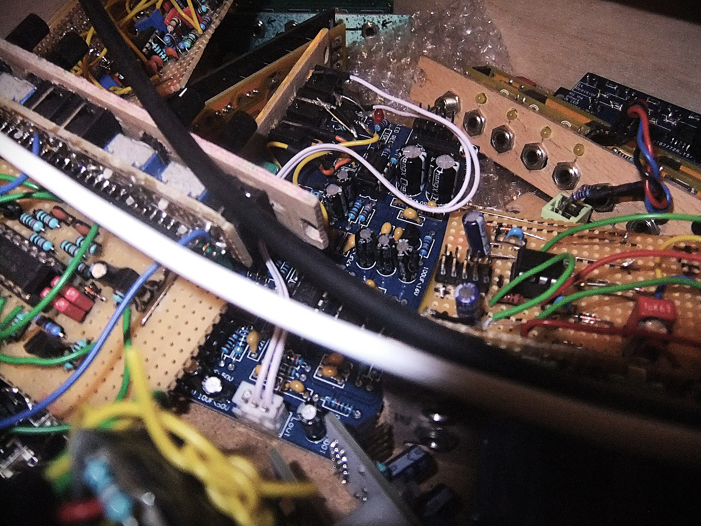

## Work in Progress
:::{#wip}
:::

## Finished Modules

These are some of the modules I have built in the past. Those where I can write something interesting have their own page and the rest is gobbled together below under [Other Modules and Prototypes](#other-modules-and-prototypes).

:::{#finished}
:::

## Other Modules and Prototypes



Here you can find all the other modules I have built in the past, including prototypes and quickly hacked together one-ofs.

This is still
```
¤¸¸.•´¯`•¸¸.•..>>   🎀  𝓊𝓃𝒹𝑒𝓇 𝒸♡𝓃𝓈𝓉𝓇𝓊𝒸𝓉𝒾🌞𝓃  🎀   >>..•.¸¸•`¯´•.¸¸¤
```

Actual photos of the modules coming soon!