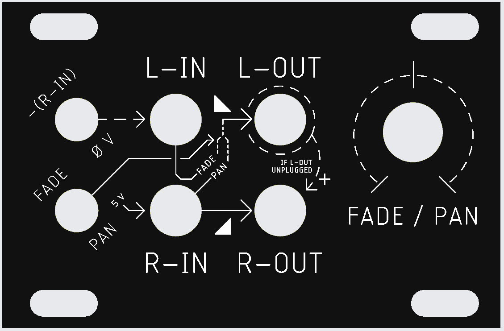
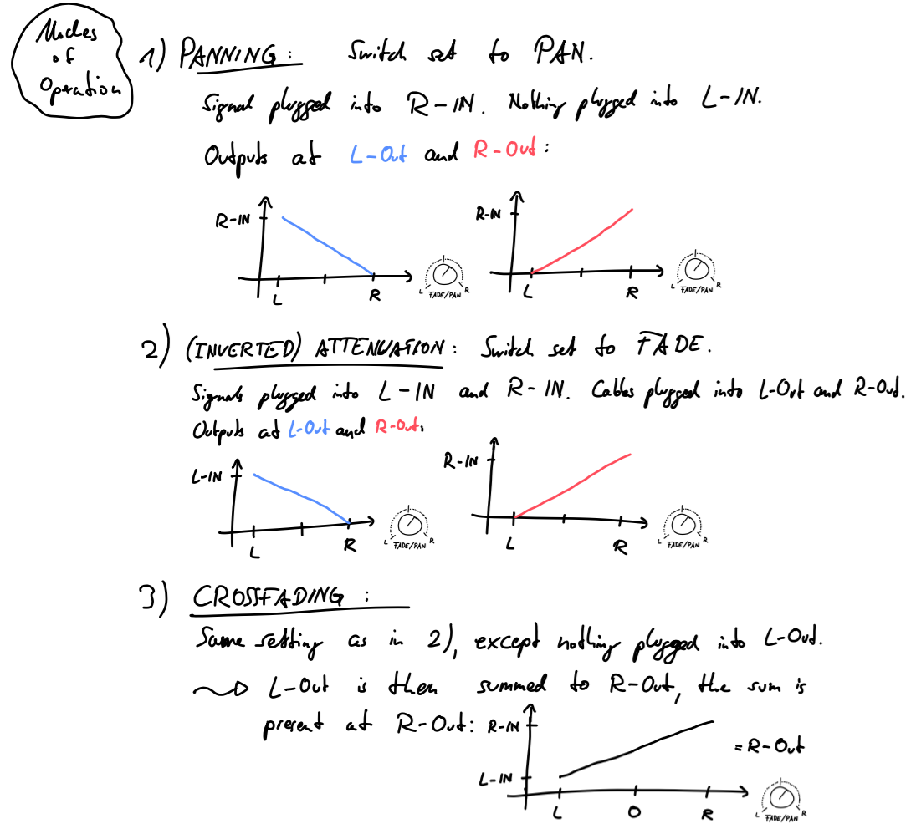

Since I like to use a lot of effects in send/return shenanigans and feedback-mixing, I wanted to have a compact crossfader in 1U format, so that i can have it accessible in the front of my rack for hands-on usage. In order to make it a more flexible module, I decided to add some normalizations and a panning-mode, since panning is basically dual to crossfading. However, this brought some challenges for front panel-design, where I think I was at least semi-successful. With the normalizations, one can use the module as an attenuator or attenuverter, if needed.

