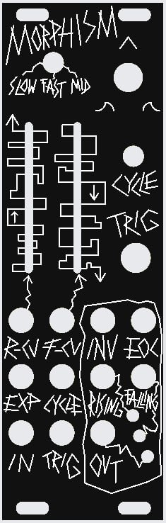
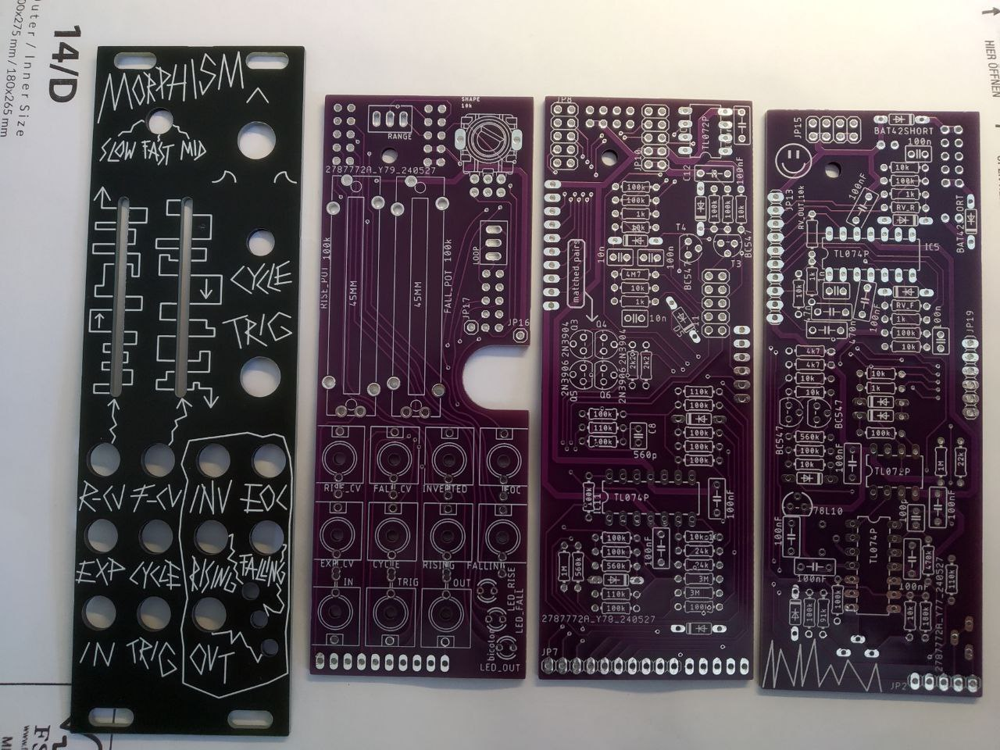
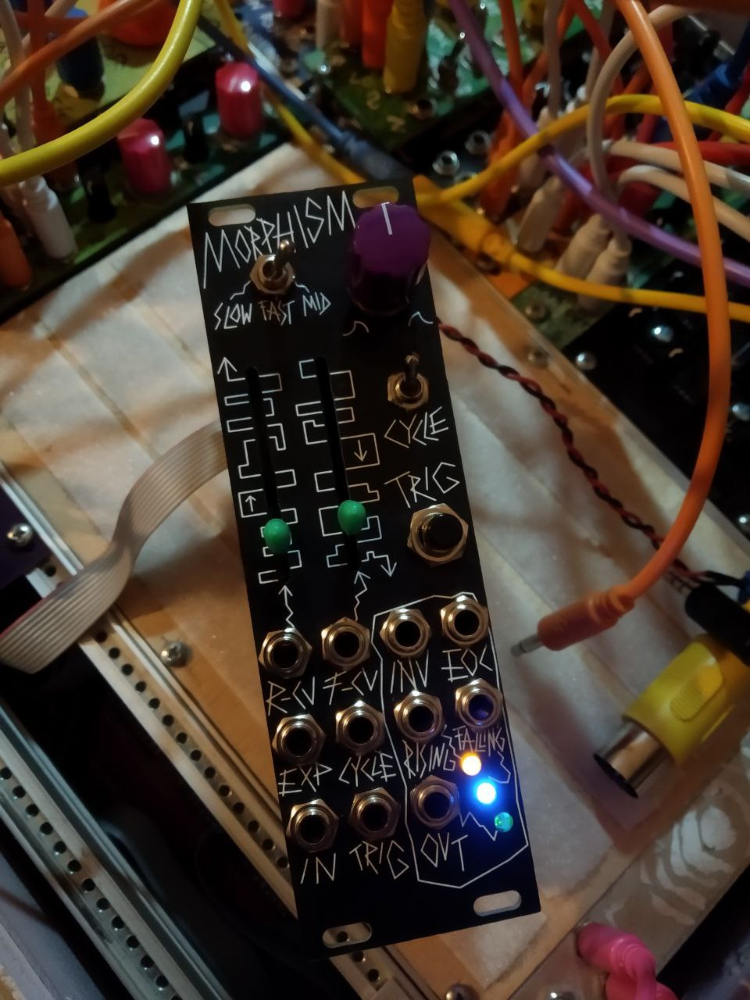
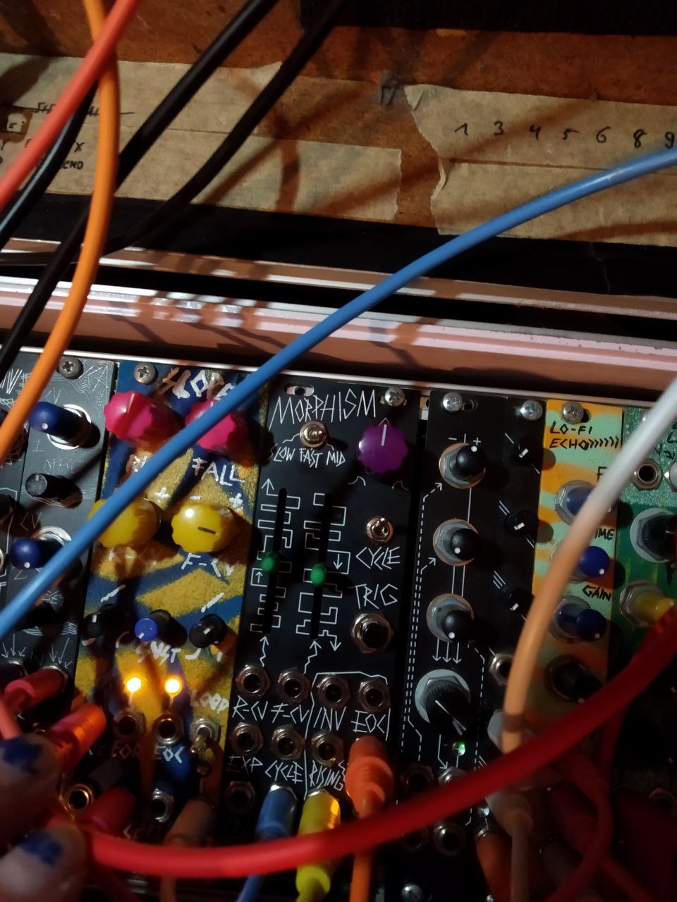
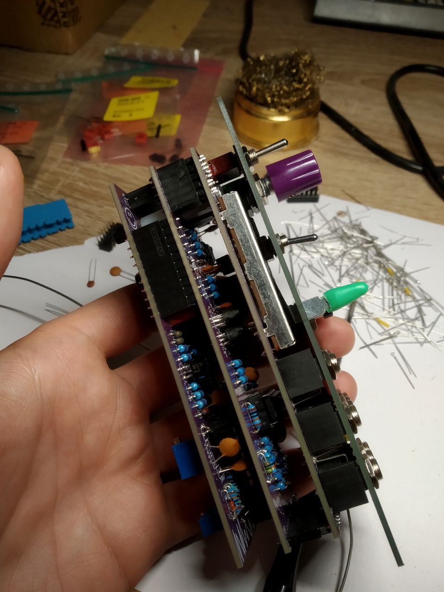
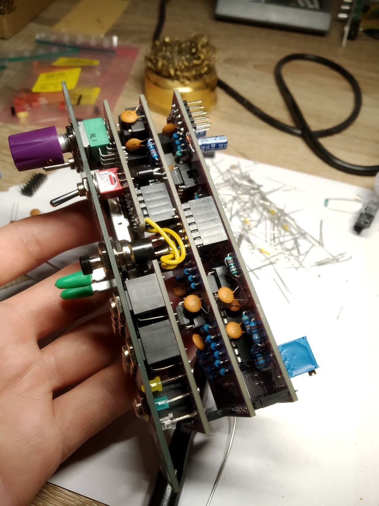

This is a slight redesign of one channel of the Befaco Rampage in an 8HP-format. The challenge here was making the PCB-layout, since I was still using THT-components at that time, so a stack of 3 PCBs was necessary. After soldering and building 4 units of this module, I swore to myself to never design modules with THT-components anymore and to finally move on to SMD-components and SMD assembly services.

:::{.masonry}

:::