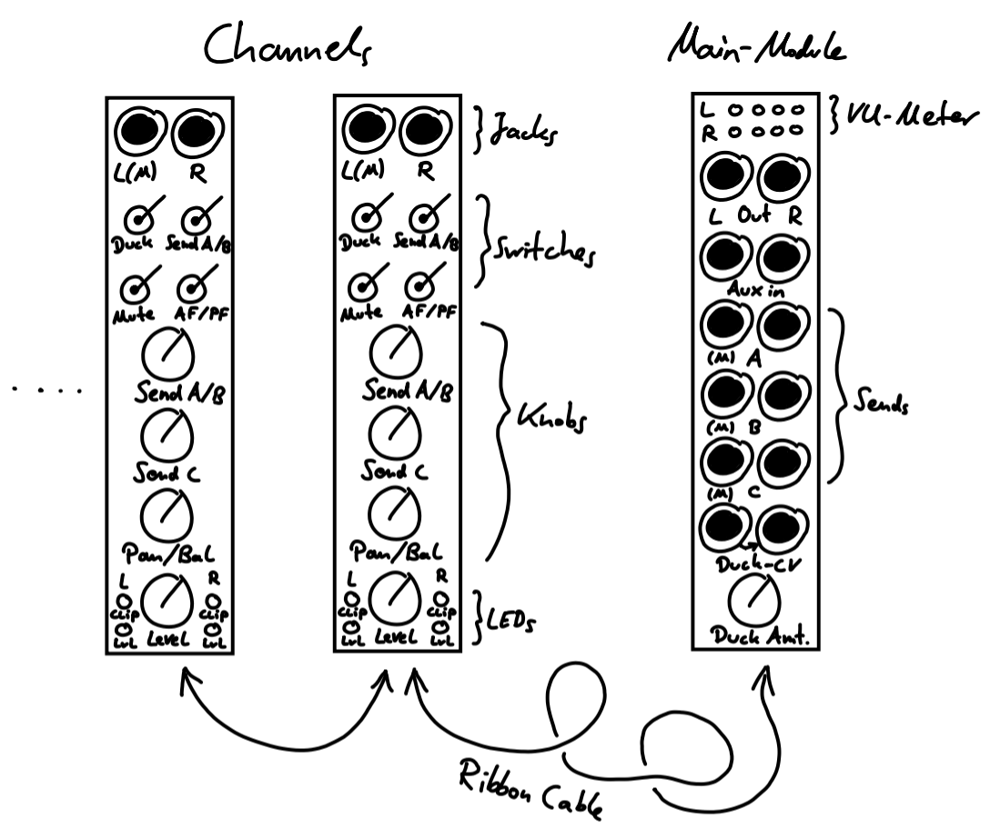
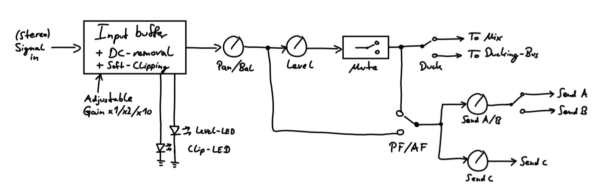

## Design Philosophy

I wanted to have a dedicated "main output"-mixer in my rack for some time now. After settling for some basic features (stereo output, FX sends, individual channel controls, etc.) the question inevitably arises: How many mono and/or stereo channels should it have? A dilemma, since no matter what amount I choose, it will never be correct on the long run. Here's why: First, I want my Eurorack setup to be fitting into a case of 7U and 84HP for ease of carrying it around with public transport and so on. Also, as is the case for many Eurorack users, my setup is never really "final" -- the curse and blessing of Eurorack -- and hence the exact number of mono/stereo channels needed will vary with time. In order to not waste valuable rack space, the natural solution is to make the mixer module itself modular. The idea is to have one main output module to which individual channel modules will be connected via ribbon cables on the back.

While others have done this before, I wanted to realize my own approach to this concept. Here are my design choices:

### Main Output Module Features

- The main output module should be stereo and include an auxiliary input for the possibility of easily including additional mixers into the main mix. I decided not to include a master volume knob, since I will feed the mixer into another module with dedicated volume control (e.g. compressor, headphone amp, dedicated output module, etc.) before going out of the rack.
- As an enjoyer of effects, I settled for 3 FX send outputs. I also incorporate a lot of feedback loops into my patches and like to send different effects into each other, so I decided to not include an FX return on the main module -- rather the FX return is done via a dedicated input channel of the mixer, thus allowing for easy feedbacking and effects into other effects. 
- Additionally, I want that the FX sends work with both mono and stereo signals. In practice this means:
  - Stereo signal to stereo FX is self-explanatory.
  - Mono signal to stereo FX: The mono signal is treated as stereo with respect to panning.
  - Stereo signal to mono FX: If channel R of the FX send is unplugged, channel L of the FX send receives the sum L+R of the input stereo signal.
  - Mono signal to mono FX: Again, a mono signal is treated as stereo with respect to panning, so the mono FX just receives the sum L+R, so the mono signal is always present independant of panning.
- In my setup, most of the time I use two "mixing busses": 
  - One that enters the final mix as it is. This consists mainly of the kick drum and other percussion.
  - One that gets ducked/sidechained by another signal. Most of the time this consists of synth voices, drones and effects that get ducked by the kick drum.
  Thus, on the main output module, there are also two mixing busses, where one of them has a CV-input for ducking purposes. Each individual channel then has a switch to select if it gets added to the main mix directly or via the ducking bus. This allows uncomplicated mixing of ducked and unducked signals at the same time.
- The main output should have a LED VU-meter with clipping indication.

### Individual Channel Features

- Of course there is a level control, In addition to that there is a level-LED as well as soft-clipping (via Zener-diodes) with LED clipping indicator.
- I don't want to differentiate between stereo and mono channels. Thus, every channel is a stereo channel. For mono input, the signal just gets duplicated to the left and right channel. The balance knob (see next point) then becomes a panning control.
- There's a mute-switch (which works via JFETs and thus is clickless).
- There's a dedicated control for one of the FX sends. Due to panel space reasons, the other two FX sends have a shared level control, while it is decided via an additional switch, which of the two sends receive the signal. All in all, one channel can use at most 2 FX sends at the same time.
- There's a switch for controlling if the FX send is after-fade (i.e. after level control and mute) or pre-fade.
- There's a switch that decides if the channel is added directly to the main mix or to the ducking mix (see above).
- Since I often use guitar pedals as effects, each channel has an adjustable gain. I would love to have this as a dedicated front panel control, but because panel space is scarce, for now this has to be set via jumper connections on the back. Maybe this can be improved in future versions.

## Current State

The schematic is almost complete and mostly verified on breadboard. Some smaller adjustments still need to be tested. The next step afterwards is making the PCB layout. Also the front panel designs have to be made.