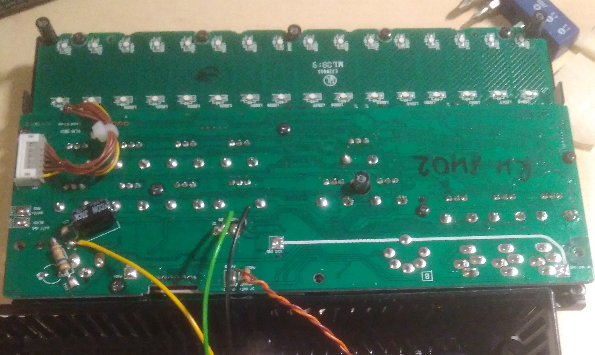
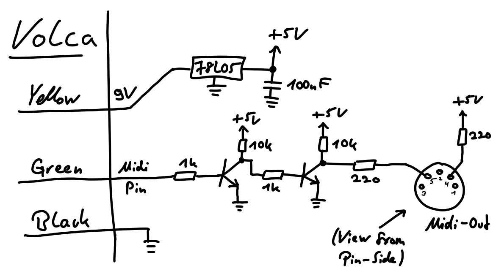

I use the Korg Volca drum as the centerpiece of my setup for some time now, but it's still "its own instrument" and integrating it into the rest of my Eurorack setup basically means that I use my Modular as a glorified mixing desk and FX rack for the drum's voices (you can have two "channels", if you pan the individual voices hard left and right and process left and right outputs differently). Luckily, the Volca drum (like other Volcas, I assume) does not only have a MIDI input, but also unused MIDI output pins on its PCB, that are not utilized in the finished product. One can then use these three pins and then build a small PCB to convert their signals into proper MIDI signals.

I still have to measure what exact MIDI messages are actually sent out from the Volca. But for now, the modification is enough to use the resulting MIDI signals in conjunction with the [Ericasynths MIDI to Trigger module](https://www.ericasynths.lv/midi-to-trigger-module-75/), so that i can trigger stuff in my rack from the Volca's sequencer.