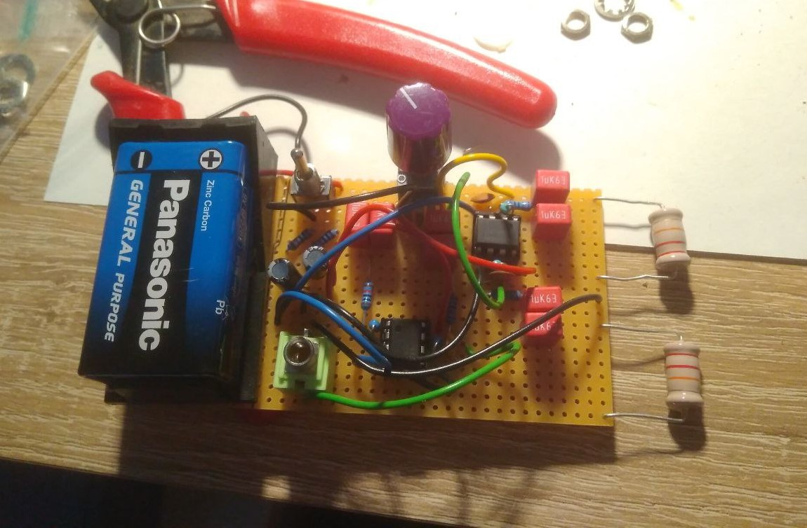

This is a small prototype consisting of a combination of the [Elektrosluch](https://kuziel.nz/notes/2016/07/elektrosluch.html) and a [Portable 9V Headphone Amplifier](https://www.redcircuits.com/Page119.htm). It's a fun party trick and can also be used as a feedback instrument when plugged into a speaker (since speakers use coils for generating the sound).
